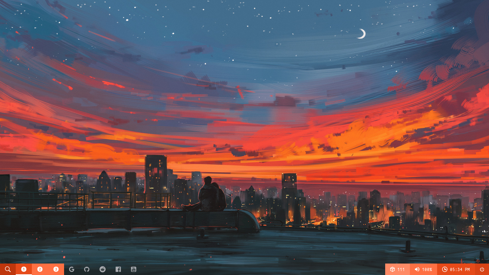
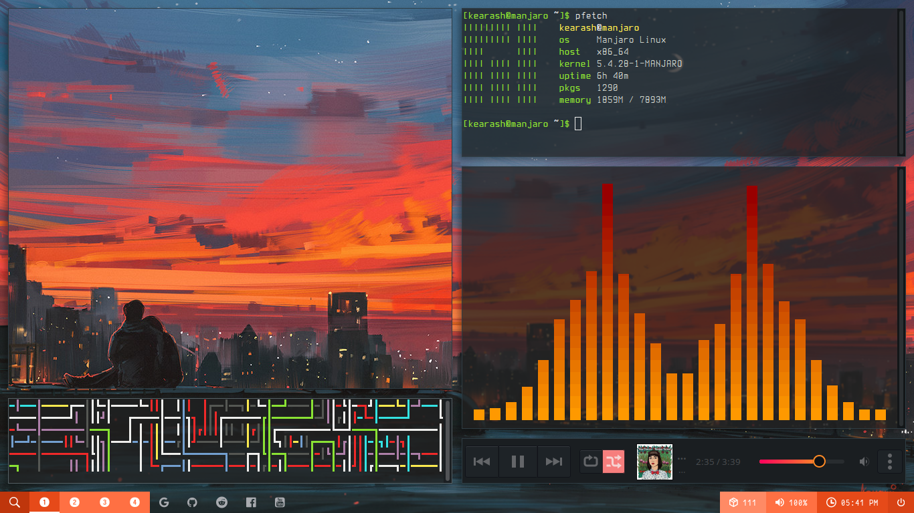

# i3-gaps-cyberpunk-2020

"The Us" Dot files
---
**OS**: Manjaro linux 

**WM**: i3-gaps 

**Bar**: polybar

**GTK theme**: Sweet-mars

**Icon theme**: Papirus-Dark

**Terminal**: xfce4-terminal

If you are here you may seen some screenshots from my [reddit](http://reddit.com/u/Kearash) or my [instagram](https://www.instagram.com/kearashy/) account
I think every thing is clear in screenshots but there is some **Notes:**

- Terminal background color is #1F1F1F
- Opacity of terminal is 0.75
- "Code - OSS" and "Discord" is transparent with "compton.conf" file
